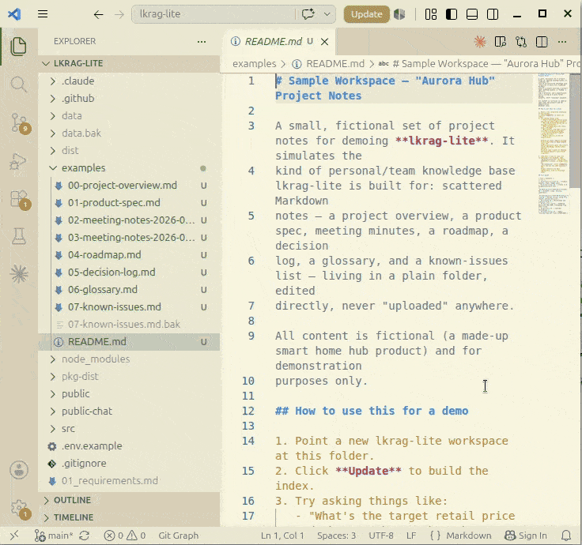

# lkrag-lite

Lightweight, easy-to-deploy RAG (Retrieval-Augmented Generation) system for local files.

## Why lkrag-lite?

Most RAG tools treat your documents as data to be *imported* into a proprietary store: you upload files, the system ingests them, and if you edit the originals you must manually re-sync. lkrag-lite takes the opposite approach — **your local directory is the knowledge base**. There is no import step; the index is always a reflection of your file system.

Hybrid BM25 + vector search is common ground now — most tools below do some version of it, so it's not a meaningful differentiator on its own. What's less crowded is the *experience*: open a browser, chat with your files, hand a read-only link to someone outside your team, and let non-engineers use it without an account, a config file, or an API key. That's the space lkrag-lite is built for.

| Feature | lkrag-lite | Dify | RAGFlow | AnythingLLM | PrivateGPT † | GPT4All (LocalDocs) | Open WebUI |
|---|:---:|:---:|:---:|:---:|:---:|:---:|:---:|
| **Search local files directly** (no upload required) | ○ | × | × | △¹ | × | ○ | ×⁹ |
| **Easy to reflect file changes** (incremental re-index) | ○ | × | × | △¹ | × | ○ | ○⁹ |
| **Citations open source files via OS** | ○ | × | × | × | × | △² | ×¹⁰ |
| **Embedded vector DB** (no separate DB server) | ○ | × | × | ○ | △³ | ○ | ○ |
| **External dependencies** (backing services + LLM/embedding provider, default deploy path) | 1⁴ | 4⁴ | 5⁴ | 0⁴ | 2⁴ | 0⁴ | 1⁴ |
| **Query rewriter** (auto-rewrites follow-up questions for RAG) | ○ | △⁵ | △⁵ | × | × | × | ○¹¹ |
| **Read-only external sharing** (link, no recipient account) | ○ | △⁶ | ×⁶ | △⁶ | × | × | △⁶ |
| **End-user chat app** (vs. developer-facing API) | ○ | △ | △ | ○ | ׆ | ○ | ○ |
| **CLI tool** (search & index management for cron / editor integration) | ○ | × | × | × | △⁷ | × | ×¹² |
| **Simple setup** (`npm install`, edit `.env`, `npm start` — no Docker/multi-container stack) | ○ | × | × | △⁸ | △ | △⁸ | ×¹³ |

¹ AnythingLLM: file-level watching only (beta); directory-wide indexing is not supported  
² GPT4All: clicking "Source" opens the referenced file per official docs; whether it launches the OS-associated app or an in-app viewer isn't specified  
³ PrivateGPT: embedded/serverless only when using Qdrant's local embedded mode; the documented default self-hosted path (docker-compose) runs Qdrant as its own service (see dependency count below)  
⁴ Counts each tool's own documented/recommended getting-started path, including the LLM/embedding provider needed to actually answer a question — not just backing infrastructure. Switching to a self-hosted local model (e.g. Ollama) instead of a cloud API doesn't reduce the count; it's still one more service to run. lkrag-lite: 1 (an LLM/embedding provider — `.env.example` defaults to OpenAI, but any OpenAI-compatible endpoint including a local Ollama works the same way). Dify: 3 backing services (Postgres, Redis, Weaviate) + 1 model provider. RAGFlow: 4 backing services (Elasticsearch/Infinity, MySQL, MinIO, Redis) + 1 model provider. PrivateGPT: 1 backing service (Qdrant, default docker-compose) + 1 model provider (its own quickstart recommends a local Ollama server). AnythingLLM and GPT4All each ship a bundled local model that runs out of the box with no external account or extra service required. Open WebUI: 1 model provider — RAG embedding defaults to a bundled local `sentence-transformers` model (no external call), but chat generation still needs a connected LLM provider (local Ollama or a cloud API); both the embedding engine and model are configurable if you want to swap them.  
⁵ Dify / RAGFlow: achievable via workflow configuration, but not automatic out of the box  
⁶ Dify: "Anyone with the link" access mode grants full interactive app access, not scoped read-only/citation viewing. RAGFlow: only an iframe embed widget requiring an API key from an authenticated user, not a plain public link. AnythingLLM: only a website-embeddable chat widget is documented; no standalone public share-link was found. Open WebUI: the "Public"/"Open" share link is read-only, but it only grants access to other signed-in users of that same instance — an unauthenticated visitor is redirected to a login page, so it isn't a no-account link like lkrag-lite's  
⁷ PrivateGPT: CLI available but limited to basic ingestion/query; no cron-friendly index management  
⁸ AnythingLLM: desktop app available, but initial configuration involves multiple steps. GPT4All: single-installer desktop app, but enabling LocalDocs requires several additional manual steps (enable extensions, choose embedding device, create a collection)  
⁹ Open WebUI syncs a local directory by **copying** it into its own internal storage ("Add Content → Sync directory", or the companion `oikb` tool for larger/scheduled syncs) — files are embedded and served from that copy, not read in place from disk. Re-syncs are incremental (SHA-256 hash comparison touches only new/changed/deleted files), which is why "reflect file changes" is ○, but the underlying model is sync-then-index, not lkrag-lite's index-in-place (see note below the table)  
¹⁰ Open WebUI: citations reference the copy stored in its Knowledge Base, not the original file, so there's no path back to opening the source document via the OS  
¹¹ Open WebUI: a built-in "RAG query generation" step reads the chat history and automatically decides whether/how to rewrite the query into 1–3 search queries before retrieval — no workflow configuration required  
¹² Open WebUI: the companion `oikb` tool syncs files into a Knowledge Base; it isn't a CLI for searching/querying documents from a terminal or editor  
¹³ Open WebUI: the officially supported install path is Docker; there's no documented single-command, non-container quickstart  

> **† PrivateGPT has pivoted from an end-user document-chat app to a developer-facing, Claude-API-compatible backend.** Its own docs state "the API is the actual product," and the bundled UI exists only to test the API, not as a finished end-user tool. Comparing it row-for-row above is somewhat asymmetric — treat it as the closest available reference point in a different product category, not a like-for-like alternative.
>
> **Open WebUI deserves a closer look than the table alone gives it** — of all the tools here, it's the one whose scale and local-directory support come closest to lkrag-lite's territory. The key design difference is *sync (copy) vs. index-in-place*: Open WebUI's directory support works by copying files into its own Knowledge Base storage (incrementally, via hashing) and answering from that copy, while lkrag-lite indexes your files where they already live and always reflects the current file on disk — there's no second copy to fall out of sync, and no storage duplication for large document sets.

## Related Projects

A few smaller, concept-adjacent tools worth knowing about, even though they're not direct competitors in the same product category as the table above:

- **[sebastianhutter/local-rag](https://github.com/sebastianhutter/local-rag)** — macOS menu-bar app; SQLite + Ollama; exposes search over local files as MCP tools for other agents, rather than a standalone chat UI.
- **[pi-local-rag](https://github.com/vahidkowsari/pi-local-rag)** — hybrid BM25 + vector search (SQLite FTS5 + sqlite-vec) very close to lkrag-lite's retrieval approach, but built as an extension for the "pi" coding agent, not a standalone browser chat app.
- **[Hermes Agent's `qmd` skill](https://github.com/NousResearch/hermes-agent/blob/main/optional-skills/research/qmd/SKILL.md)** — local hybrid (BM25 + vector + LLM rerank) retrieval over a document directory, exposed as an agent skill/MCP server rather than an end-user chat app.

Each of these proves the retrieval approach (local files, hybrid search, embedded SQLite) is not unique to lkrag-lite. What's different here is the delivery: a browser-based chat UI usable by non-engineers, with read-only external sharing, rather than an MCP tool or agent extension aimed at other tools/agents.

## Features

- **Workspace management**: named workspaces pointing to local directories, one active at a time
- **Incremental indexing**: re-indexes only changed files (mtime + size + SHA-256 hash)
- **Supported file types**: Markdown, plain text, PDF, Word (.docx), Excel (.xlsx), PowerPoint (.pptx), HTML
- **Hybrid search**: combines vector similarity search (sqlite-vec) with full-text BM25 search (SQLite FTS5), merged via Reciprocal Rank Fusion (RRF) for better recall on both semantic and keyword queries
- **Cited answers**: LLM answers with inline `[n]` citation numbers linked to source files
- **File open**: click a citation to open the original file with the OS-associated application
- **Flexible LLM/Embedding**: OpenAI / Anthropic / any OpenAI-compatible endpoint (LiteLLM, Ollama)
- **Runtime settings UI**: adjust Top K, Min Similarity, and Output Instructions from the browser without restarting the server
- **Multi-turn chat**: conversational UI that carries context across turns
- **Query rewriter**: LLM automatically rewrites follow-up questions into clean, standalone RAG search queries
- **Document tags**: tags come from the files themselves (Markdown frontmatter `tags:`), from the path (`ext:pdf`, `dir:<folder>`), or are added by hand in the UI (any file type, e.g. PDF/Office); see related tags for each answer, require or exclude tags in a search, re-ask a question limited to (or without) a tag, and set default required/excluded tags in `.env` — enforced for the public chat (see [Document Tags](#document-tags))
- **Chat history**: chats are auto-saved to SQLite and can be resumed at any time; history is shown across all workspaces
- **CLI tool** (`lkragl`): command-line interface for search and index management, suitable for cron jobs, editor integrations, and automation
- **Public chat**: token-authenticated, read-only chat UI for sharing a single workspace with other people, served on a separate network-reachable port (see [Public Chat](#public-chat))

## Requirements

- Node.js 20 or 22 LTS
- npm

## Setup

```bash
git clone https://github.com/patakuti/lkrag-lite.git
cd lkrag-lite
npm install
cp .env.example .env
# Edit .env and set your API keys and preferences
npm run build
npm start
```

Open http://localhost:4456 in your browser.

### Restarting and auto-start

Starting the server while another lkrag-lite is already running on the same `PORT` **replaces** it, so the new process picks up the current environment variables and `.env`. If the running server is busy (indexing, or answering a chat), it is left untouched and the newly started process exits with a message instead. Nothing is interrupted, and you can simply start it again later.

Running the same start command again is therefore also how you restart the server (e.g. after `npm run build`). It also makes it easy to keep the server up while you are working. Pick **one** of the following; don't combine them.

#### Linux (desktop): systemd user service

Starts the server with your desktop session and stops it at logout, so it always runs with the current session's environment (`DISPLAY` etc.). Create `~/.config/systemd/user/lkrag-lite.service` (adjust the path to your clone):

```ini
[Unit]
Description=lkrag-lite server
PartOf=graphical-session.target
After=graphical-session.target

[Service]
WorkingDirectory=%h/lkrag-lite
ExecStart=/usr/bin/env node dist/server.js
Restart=on-failure
RestartSec=3

[Install]
WantedBy=graphical-session.target
```

```bash
systemctl --user daemon-reload
systemctl --user enable --now lkrag-lite
journalctl --user -u lkrag-lite -f      # logs
```

- `WorkingDirectory` matters: `.env` is read from the current directory.
- If `node` is not on the user manager's `PATH` (e.g. installed via nvm), replace `/usr/bin/env node` with the absolute path from `which node`.
- After `npm run build`, run `systemctl --user restart lkrag-lite`. Starting the server by hand (`npm start`) also replaces the service's process; the service then stays stopped until the next login.
- Do not enable `loginctl enable-linger` for this: the server is meant to run only while your desktop session exists.

#### Windows + WSL1 (and other Linux setups without systemd): `~/.bashrc`

WSL1 has no systemd. Instead, start the server from your shell startup file so it is up whenever a WSL terminal is open. Add this line to `~/.bashrc` (adjust the path):

```bash
(cd ~/lkrag-lite && nohup node dist/server.js >> ~/lkrag-lite.log 2>&1 &)
```

- Every new terminal runs it: if the server is idle it is replaced by a fresh one (with the current environment and `.env`); if it is busy, the new process just exits and the running server is left alone.
- On WSL1, background processes normally end when the last terminal is closed. If a server is left running, stop it with `pkill -f 'node dist/server.js'`.
- Logs go to `~/lkrag-lite.log`.
- After `npm run build`, run the same command by hand to restart with the new build.
- The Windows browser can reach the server at `http://localhost:4456`, since WSL1 shares the host network.

## Try it with sample data

No documents of your own yet? [`examples/`](examples/) contains a small fictional
project-notes dataset (overview, spec, meeting notes, roadmap, decision log,
glossary, known issues) you can point a workspace at right away — see
[`examples/README.md`](examples/README.md) for setup steps and example questions
to ask. `examples/demo.gif` shows the full flow (indexing → chat → citations →
live re-index after an edit) end to end:



## Configuration (`.env`)

### Database

| Variable | Default | Description |
|---|---|---|
| `DATABASE_PATH` | Win: `%APPDATA%\lkragl\lkrag.db` / Linux・Mac: `~/.local/share/lkragl/lkrag.db` | SQLite database file path |
| `SQLITE_JOURNAL_MODE` | `wal` (Linux/Mac/WSL2), `delete` (WSL1 auto-detected) | SQLite journal mode. WSL1 is detected automatically and uses `delete` mode since WAL requires mmap/fcntl support unavailable in WSL1. |

### Index targets

| Variable | Default | Description |
|---|---|---|
| `RAG_INCLUDE_PATTERNS` | `**/*.md,...` | Glob patterns for files to index (comma-separated). To index PowerPoint files, add `**/*.pptx`. |
| `RAG_EXCLUDE_PATTERNS` | `node_modules/**,.git/**` | Glob patterns to exclude |

### Embedding

| Variable | Default | Description |
|---|---|---|
| `EMBEDDING_PROVIDER` | `openai` | `openai` / `openai-compatible` (use `openai-compatible` for LiteLLM, Ollama, llama.cpp's `llama-server`, etc.) |
| `EMBEDDING_MODEL` | `text-embedding-3-small` | Embedding model name |
| `EMBEDDING_API_KEY` | — | API key used for the embedding call (both `openai` and `openai-compatible`) |
| `EMBEDDING_BASE_URL` | `http://localhost:4000/v1` | Base URL used only when `EMBEDDING_PROVIDER=openai-compatible` (e.g. `http://localhost:11434/v1` for Ollama, `http://localhost:8080/v1` for llama.cpp's `llama-server`) |
| `EMBEDDING_QUERY_PREFIX` | _(empty)_ | Prefix prepended to query text before embedding (some models require e.g. `"query: "`) |
| `EMBEDDING_DOCUMENT_PREFIX` | _(empty)_ | Prefix prepended to document text before embedding (some models require e.g. `"passage: "`) |
| `EMBEDDING_BATCH_SIZE` | `500` | Number of texts embedded per API call |

> **`*_BASE_URL` gotcha**: this app always sends `POST {BASE_URL}/embeddings` (and `{BASE_URL}/chat/completions` for LLM/Rewriter) — the OpenAI-compatible route. Set `*_BASE_URL` to the API root the server exposes that route under (usually ending in `/v1`), **not** a vendor-specific native endpoint path (e.g. llama.cpp's own `/embedding`). If you point it at the wrong path, you'll get a 404 whose message now includes the exact URL that was requested — use that to spot a doubled or wrong path.

### LLM

| Variable | Default | Description |
|---|---|---|
| `LLM_PROVIDER` | `openai` | `openai` / `anthropic` / `openai-compatible` |
| `LLM_MODEL` | `gpt-4o-mini` | LLM model name |
| `LLM_API_KEY` | — | API key used for the LLM call (both `openai` and `openai-compatible`) |
| `LLM_BASE_URL` | `http://localhost:4000/v1` | Base URL used only when `LLM_PROVIDER=openai-compatible` |
| `ANTHROPIC_API_KEY` | — | Anthropic API key, used when `LLM_PROVIDER=anthropic` and/or `QUERY_REWRITER_PROVIDER=anthropic` |

### RAG parameters

| Variable | Default | Description |
|---|---|---|
| `RAG_MAX_FILE_SIZE` | `10485760` (10MB) | Maximum file size in bytes to index; larger files are skipped |
| `RAG_CHUNK_SIZE` | `1000` | Chunk size in characters |
| `RAG_CHUNK_OVERLAP` | `200` | Overlap between consecutive chunks |
| `RAG_TOP_K` | `5` | Number of chunks to retrieve (overridable from UI) |
| `RAG_MIN_SIMILARITY` | `0.3` | Minimum cosine similarity score 0–1 applied to vector results before RRF merge (overridable from UI) |
| `RAG_OUTPUT_INSTRUCTIONS` | _(empty)_ | Extra instructions appended to the LLM system prompt, e.g. `"Answer in Japanese."` (overridable from UI) |
| `RAG_DEFAULT_REQUIRED_TAGS` | _(empty)_ | Comma-separated tags every search requires by default (see [Document Tags](#document-tags)). Read at startup; restart to change |
| `RAG_DEFAULT_EXCLUDE_TAGS` | _(empty)_ | Comma-separated tags whose documents every search skips by default, e.g. `obsolete,dir:archive`. Enforced for the public chat. Read at startup; restart to change |

### Query Rewriter

| Variable | Default | Description |
|---|---|---|
| `QUERY_REWRITER_PROVIDER` | `openai` | `openai` / `anthropic` / `openai-compatible` |
| `QUERY_REWRITER_MODEL` | `gpt-4o-mini` (openai) / `claude-haiku-4-5` (anthropic) | Model used by the query rewriter |
| `QUERY_REWRITER_API_KEY` | — | API key used when `QUERY_REWRITER_PROVIDER` is `openai` / `openai-compatible` (uses `ANTHROPIC_API_KEY` when `anthropic`) |
| `QUERY_REWRITER_BASE_URL` | `http://localhost:4000/v1` | Base URL used only when `QUERY_REWRITER_PROVIDER=openai-compatible` |

### Server

| Variable | Default | Description |
|---|---|---|
| `PORT` | `4456` | HTTP server port. Starting a second server on the same port replaces the running one unless it is busy (see [Restarting and auto-start](#restarting-and-auto-start)). |
| `BROWSE_ROOT` | _(user home)_ | Top directory exposed by the file browser when adding a workspace. Restricts navigation to this directory and its subdirectories. Useful when home directory is too broad (e.g. set to `D:\Projects` on Windows or `/data` on Linux). |

### Public chat

| Variable | Default | Description |
|---|---|---|
| `PUBLIC_PORT` | _(unset)_ | If set, starts a separate, network-reachable (`0.0.0.0`) read-only chat server on this port, gated by tokens issued with `lkragl token create`. Unset by default (feature disabled). See "Public Chat" below. |
| `PUBLIC_CHAT_RATE_LIMIT_PER_MIN` | `20` | Max `POST /api/chat` calls per token per rolling minute; each call bills an LLM query-rewrite + answer call, so this caps API cost exposure per token. |

Not sure which Embedding/Rewriter/LLM combination to pick? See
[docs/recommended-configs.md](docs/recommended-configs.md) for recommended
Cloud / Local (CPU) / Local (GPU) presets for English and Japanese, with
ready-to-paste `.env` blocks.

## Usage

1. **Add a workspace**: click "+ Add..." and pick a directory
2. **Activate**: select a workspace from the dropdown to make it active
3. **Index**: click "Update" (incremental) or "Full Rebuild"
4. **Chat**: type a question and click "Send"; follow-up questions carry conversation context automatically
5. **Citations**: click `[n]` in the answer or "Open" in the References section to open the source file
6. **Chat history**: past chats appear in the "Chat History" column on the left; click one to resume (workspace switches automatically). "☰ History" in the chat header hides / shows the column (the choice is remembered in the browser). On narrow screens (under 700px) the column is stacked above the chat, starts collapsed, and collapses again after you pick a chat
7. **New Chat**: click "New Chat" to start a fresh conversation
8. **Delete chats**: click "×" next to a chat to delete it, or "Delete All" to clear all history
9. **Settings**: adjust Top K, Min Similarity, and Output Instructions in the Settings panel; click "Reload .env" to reset to the values in `.env`
10. **Tags**: see [Document Tags](#document-tags)

## Document Tags

Tags let you group documents, narrow a search to a group, and leave a group out. There are three kinds:

| Kind | Source | Editable |
|---|---|---|
| **File tags** (blue) | Markdown (`.md`) only: frontmatter `tags:` / `tag:` (inline list, block list, or comma/space-separated). `#tag` written in the body text is **not** imported — a `#` in prose is often a chat channel, an issue number or a heading, so tags must be written in the frontmatter. | Edit the file, then run "Update". |
| **Manual tags** (amber) | Added in the UI on any indexed file — including PDF, Word, Excel, PowerPoint, HTML and plain text. Stored only in lkrag-lite's database; your files are never modified. | Add / remove in the UI |
| **System tags** (grey) | Derived from the file's path for every indexed file: `ext:<extension>` (lower-case, e.g. `ext:pdf`, `ext:md`) and `dir:<top-level folder>` (e.g. `dir:設計`; files directly in the workspace root get no `dir:` tag; whitespace, `,` and `#` in the folder name become `-`). | No — they follow the path automatically |

```markdown
---
tags: [design, 認証]
---
Body text. A #hashtag like this is not a tag.
```

- **Normalization**: tags are trimmed, lower-cased and NFKC-normalized (`Design` and `design` are the same tag). A tag is 1–64 characters with no whitespace, `,` or `#`. `a/b` is just one string; there is no hierarchy.
- **Reserved prefixes**: `ext:` and `dir:` belong to system tags. A document or a manual tag cannot use them (the tag is ignored / rejected), so a system tag can always be trusted in a filter.
- **In the chat UI**: each reference shows its file's tags (system tags last, greyed out, not removable). Type in a reference's `+ tag` box to add a manual tag (autocomplete offers existing tags) and click `✕` on a manual tag to remove it. Below each answer, **Related tags** lists the tags of the cited documents (with the number of documents; system tags are left out to avoid noise). Click a tag to ask the same question again limited to it, or click the `−` next to it to ask again *excluding* it. The new turn is added and the previous answer stays for comparison.
- **Tag filter**: the row above the input box limits every question in the current chat.
  - `tag` requires it: a document must have **all** required tags (AND).
  - `-tag` excludes it: a document with **any** excluded tag is skipped (excluded tags are red `−#tag` chips). A tag that is both required and excluded matches nothing (exclusion wins); adding it to one list removes it from the other.
  - Any tag works, including system tags — e.g. `-dir:archive` or `ext:pdf`.
  - The filter is applied before ranking, so Top K is filled from the matching documents. It is saved with the question and restored when you resume the chat; "New Chat" resets it to the defaults below.
- **Default conditions (`.env`)**: `RAG_DEFAULT_REQUIRED_TAGS` and `RAG_DEFAULT_EXCLUDE_TAGS` (comma-separated), e.g. `RAG_DEFAULT_EXCLUDE_TAGS=obsolete,dir:archive`.
  - Admin UI: they are the starting filter of every new chat, shown as chips you can remove for that chat. Resuming a chat restores exactly what was saved for it.
  - CLI: `lkragl search` applies them unless `--no-default-tags` is given.
  - They are read when the server starts (restart after changing; "Reload .env" does not apply). The server and the CLI refuse to start if an entry is invalid (e.g. contains whitespace) or a tag is in both lists, rather than silently ignoring it.
  - **Public chat: enforced** — see below.
- **Existing indexes**: file and system tags are picked up by the next "Update" without re-embedding. Manual tags survive "Update" and "Full Rebuild".
- **Renames and moves**: manual tags are attached to the file's path relative to the workspace, so renaming or moving a file detaches them (moving it back reattaches them). System tags follow the new path automatically. Deleting a workspace deletes its manual tags.
- **Public chat**: viewers can see tags and related tags, and require / exclude tags, but cannot add or remove manual tags (admin-only).

### Hiding documents from the public chat

The default conditions are **enforced on the server** for the public chat, so they can be used to keep documents (e.g. `RAG_DEFAULT_EXCLUDE_TAGS=obsolete,internal`) away from the people you share a workspace with:

- Every search adds the condition; a viewer cannot remove or override it (an excluded tag wins over anything they require). The chat UI shows the condition as dashed 🔒 chips that have no `✕`.
- A document that does not pass the condition is `404` on `GET /api/file` (view and download), even if the path is guessed. When a condition is set, files that are not in the index are `404` too.
- The tag list and tag lookup only report tags (and counts) of documents that pass the condition, so tag names of hidden documents are not revealed.
- The admin UI, admin API and CLI are not restricted.

> **Note:** the condition applies to searches, files and tags from the moment the server runs with it. Chat history that was saved *before* you added a condition still contains the answers and citations from earlier searches, which can include documents you now hide. Delete the public chat histories first (recipients can use "Delete All" in the Chat History panel) or revoke and re-issue the tokens before relying on a new condition. The condition itself (e.g. `−#obsolete`) is visible to viewers.

## CLI Tool (`lkragl`)

A command-line interface for index management and search, suitable for cron jobs, editor integrations, and automation.

### Installation

**Windows** — download the prebuilt binary from [GitHub Releases](https://github.com/patakuti/lkrag-lite/releases):

1. Download `lkragl-windows-x64.exe` from the latest release
2. Place it somewhere in your `PATH` (e.g. `C:\Users\<you>\bin\`)
3. Run `lkragl` from the command prompt or PowerShell

**Linux / macOS** — install via npm after cloning and building the server:

```bash
npm run build
npm link   # makes lkragl available in PATH
```

### Configuration

`lkragl` loads `.env` files in the following order (later entries take priority):

1. User config dir — `%APPDATA%\lkragl\.env` (Windows) / `~/.config/lkragl/.env` (Linux/Mac)
2. Current working directory — `./.env`
3. `--env-file <path>` — explicit path (highest priority)

For the Windows binary, place your `.env` in `%APPDATA%\lkragl\` (e.g. `C:\Users\<you>\AppData\Roaming\lkragl\.env`).

### Commands

```
lkragl search <query>       Search indexed documents
lkragl update-index         Incrementally update the index
lkragl rebuild-index        Rebuild the entire index from scratch
lkragl status               Show index status
lkragl tags                 List document tags with the number of documents
```

### Options

| Option | Default | Description |
|--------|---------|-------------|
| `--workspace-path <path>` | current directory | Workspace to operate on (mutually exclusive with `--find-workspace`) |
| `--find-workspace` | — | Traverse up from current directory to find a registered workspace |
| `--limit <n>` | 5 | Number of search results (`search` only) |
| `--min-similarity <n>` | 0.3 | Minimum similarity score 0–1 (`search` only) |
| `--tag <tag>` | — | Only documents having this tag; repeat to require several (AND) (`search` only) |
| `--exclude-tag <tag>` | — | Skip documents having this tag; repeat to exclude several (`search` only) |
| `--no-default-tags` | — | Ignore `RAG_DEFAULT_REQUIRED_TAGS` / `RAG_DEFAULT_EXCLUDE_TAGS` (`search` only) |
| `--format <fmt>` | plain | Output format: `plain`, `tsv`, `json` (`search` only); `plain`/`json` for `tags` |
| `--quiet` | — | Suppress informational messages on stderr |
| `--env-file <path>` | — | Load additional .env file |

`--workspace-path` and `--find-workspace` are mutually exclusive.

### Workspace resolution

| Command | Unregistered path | `--find-workspace` (not found) |
|---------|-------------------|-------------------------------|
| `search` | Error | Error |
| `update-index` | Error | Error |
| `rebuild-index` | **Auto-register**, index, and **activate** | Error |
| `status` | Error | Error |

`rebuild-index` activates the workspace upon completion so it is immediately usable from the Web UI. `update-index` does not change the active workspace (safe for cron jobs).

### Examples

```bash
# Search with plain output
lkragl search "authentication flow" --workspace-path /path/to/docs

# Search from a subdirectory — finds the nearest indexed ancestor automatically
lkragl search "error handling" --find-workspace

# TSV output for editor integration (path, line, score, content, tags; the tags column includes system tags)
lkragl search "setup guide" --format tsv --limit 10

# Only documents tagged both "design" and "auth", but not "obsolete"
lkragl search "token refresh" --tag design --tag auth --exclude-tag obsolete

# Only PDFs in the top-level "manuals" folder (system tags)
lkragl search "warranty" --tag ext:pdf --tag dir:manuals

# Ignore the default conditions from .env for this search
lkragl search "old design" --no-default-tags

# List tags and how many documents have each
lkragl tags

# JSON output for scripting
lkragl search "database schema" --format json | jq '.[0].filePath'

# Register and build index for the first time
lkragl rebuild-index --workspace-path /path/to/docs

# Update index incrementally from a subdirectory
lkragl update-index --find-workspace

# Schedule index updates via cron (daily at 3am)
# 0 3 * * * lkragl update-index --workspace-path /path/to/docs

# Check index status
lkragl status --workspace-path /path/to/docs
lkragl status --find-workspace
```

## Public Chat

A read-only, token-authenticated chat UI for sharing a single workspace with other people, served on a separate port from the admin UI so the workspace-management API is never network-reachable. Set `PUBLIC_PORT` in `.env` to enable it.

Tokens are managed with `lkragl`:

```bash
lkragl token create --workspace-path /path/to/docs --name alice   # prints the token once; store it securely
lkragl token list                                                 # label, workspace, enabled/revoked
lkragl token revoke <id>                                          # disable a token
```

Deleting a workspace revokes all of its tokens.

Share `http://<host>:<PUBLIC_PORT>/?token=<token>` with the recipient. The page exchanges the token for an `HttpOnly` cookie on first load (redirecting to a clean URL), so the token itself doesn't stay visible or need to be resent. The UI supports multi-turn chat (with the same query rewriter as the admin UI) and a "Chat History" column (collapsible, same as the admin UI) scoped to that token's workspace; citations link to `GET /api/file?path=...` to view the source file in the browser, or `&download=1` to download it — there is no workspace switching, index management, or settings, and no ability to delete chat history from this UI. Recipients can see document tags, related tags and require / exclude tags (see [Document Tags](#document-tags)), but cannot edit tags. `RAG_DEFAULT_REQUIRED_TAGS` / `RAG_DEFAULT_EXCLUDE_TAGS` are enforced for them — see [Hiding documents from the public chat](#hiding-documents-from-the-public-chat).

> **Note:** `PUBLIC_PORT` serves plain HTTP with no built-in TLS — the token travels in cleartext over the network (in the URL on first load, then in a cookie). If recipients are not on a trusted LAN/VPN, put a TLS-terminating reverse proxy (nginx, Caddy, cloudflared, etc.) in front of it.

Every chat turn is recorded in an access log (token, query, prompt/completion token counts). Set `LLM_PRICE_INPUT_PER_1M` / `LLM_PRICE_OUTPUT_PER_1M` in `.env` to also record an estimated USD cost per request; otherwise only token counts are recorded.

## Changing the Embedding Model

If you change `EMBEDDING_MODEL` to a model with a different vector dimension, the server will return an error on the next indexing or search. Run a **full rebuild** to re-embed all documents with the new model.

## Troubleshooting

**`Error: LLM API unreachable at <URL>: fetch failed (ECONNREFUSED: ...)`** — the server could not connect to the LLM (answer generation) endpoint. The message includes the URL that was requested and the underlying cause (`ECONNREFUSED`: nothing is listening there, `ENOTFOUND`: the host name does not resolve, etc.). Check `LLM_PROVIDER` / `LLM_BASE_URL` in your `.env`; the resolved settings of all three roles are printed at startup as `[config]` lines. Embedding failures are reported the same way (`Embedding API unreachable at ...`).

`lkragl search` only uses the embedding model, so it can succeed while the web UI fails because of the LLM or query rewriter settings. The same errors are also written to the server's stderr (`[search] request failed: ...` / `[chat] request failed: ...`), and a query rewriter failure is logged as `[rewriter] falling back to the original query: ...`.

## Development

```bash
npm run dev   # tsx watch mode (auto-reload on source change)
```

## Architecture

```
[Browser: admin UI]        [Browser: public chat]      [CLI: lkragl]
    ↕ HTTP (127.0.0.1)          ↕ HTTP (0.0.0.0)              ↕
[Admin app: server.ts]     [Public app: publicServer.ts]  [cli.ts]
    ├── Indexer (fast-glob → parser → chunker → Embedding API → sqlite-vec)
    ├── Query Rewriter (conversation history + user input → clean RAG query)
    ├── Retriever (RAG query → Embedding API → vector KNN + FTS5 BM25, optionally pre-filtered by tag → RRF merge)
    ├── LLM (conversation history + RAG context + user input → cited answer)
    └── SQLite + sqlite-vec (embedded vector DB, shared by both apps)

Public app has no admin routes mounted and skips the Host-header guard;
every request is instead gated by a per-recipient token (middleware/publicAuth.ts)
resolved to a single workspace, disabled unless PUBLIC_PORT is set.
```

## About this project

This tool was designed and implemented entirely by Claude. The human provided the idea. However, this isn't a one-shot output; the human shaped it through hands-on testing and iterative, detail-oriented feedback.

## License

[MIT](LICENSE)
